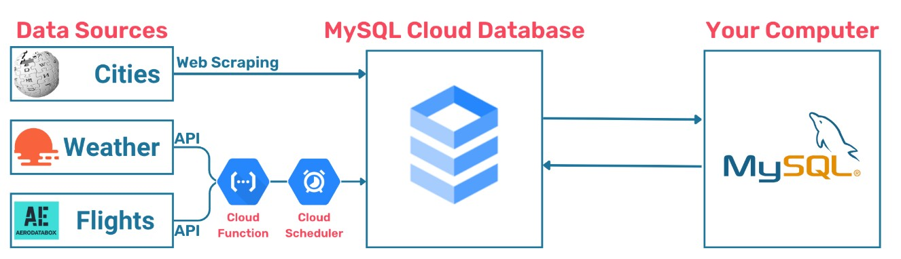

# Fully automated data pipeline on GCP

## Overview

In this case study I created my first fully automated data pipeline on the Google Cloud Platform. The task was to create a pipeline following the flowchart below:




## Methodology

1. **Create Google Cloud instance and connect to mySQL Workbench**  
Created a Google Cloud SQL (MySQL) instance, configured public IP access, and connected it to MySQL Workbench for remote database management.<br><br>

2. **Create database structure with mySQL Workbench**  
Created database structure with mySQL Workbench. The code for the database structure creation can be found in `City_Info_Database.sql`<br><br>

3. **Webscapping**  
Using BeautifulSoup I scrapped geographical and population information for different cities from their wikipedia sites.<br><br>

4. **Deploying Google cloud functions**
For gathering weather and flight arrival information the following APIs were used:
- [openweathermap 5 day / 3 hour forecast data](https://openweathermap.org/forecast5)
- [rapid_api_aerodatabox_Airport_API](https://rapidapi.com/aedbx-aedbx/api/aerodatabox)  

After integrating these APIs into functions following the required Google Cloud Functions structure, they were tested locally before Deployment on GCP. After successful testing the two functions were deployed on GCP.<br><br>

6. **Automation of cloud function execution**  
Following the successful deployment of the functions the GCP Cloud Scheduler was used for the automatization of the function execution. Triggered by the Cloud Scheduler, every day at the set time, current weather forecast and flight information was gathered and saved in the database.<br><br>

## Tools & Technologies

- Python (Pandas, BeautifulSoup, sqlalchemy, pymysql, functions_framework) for webscrapping, function creation and data exchange with mySQL database.
- Jupyter Notebook for an integrated code and report environment
- Google Cloud Platform mySQL, Functions and Scheduler

## Repository Contents

- `City_Info_Database.sql`: sql script for database structure creation
- `Webscrapped_City_Info.ipynb`: Jupyter notebook for webscrapping and data transfer to GCP database
- `city_functions.py`: .py file containing webscrapping functions
- `Cloud_Flight_function_test.ipynb`: Jupyter notebook with flight info function and local testing
- `Cloud_weather_function_local_test.ipynb.ipynb`: Jupyter notebook with weather info function and local testing

## Environment Variables
If you are using `.env` file it should include:

```
schema=NAME_OF_YOU_SCHEMA
host=PUBLIC_IP_OF_YOUR_GCP_SQL_INSTANCE
user=YOUR_SQL_USERNAME
password=YOUR_GCP_SQL_INSTANCE_PASSWORD
port=YOUR_PORT
weather_API_key=YOUR_OPENWEATHERMAP_APIKEY
RapidAPI_key=YOUR_RAPIDAPI_APIKEY
```
See also the `exmple_variables.env` file.  

If you define your environment variables on GCP, make sure you use the same variable names as above.

## How to Run

1. Clone the repository.
2. Create Google Cloud instance and connect to mySQL Workbench.
3. Open Google Cloud instance and run `City_Info_Database.sql` in mySQL Workbench for creation of database structure.
4. Ensure the file `city_functions.py` is in the same directory as the other notebooks.
6. Run all cells in the Jupyter notebook `Webscrapped_City_Info.ipynb` sequentially to transfer geographical and population information to database.
7. Run `Cloud_Flight_function_test.ipynb` and `Cloud_weather_function_local_test.ipynb.ipynb` to test them locally.
8. Create functions on GCP and make sure to use python 3.9 for runtime. Copy paste the code of the functions from the jupyter notebooks to GCP and deploy the functions.
9. (Optional) Use GCP Scheduler to fully automate the pipeline and execute the functions at desired frequency.
